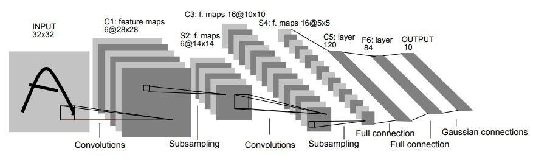
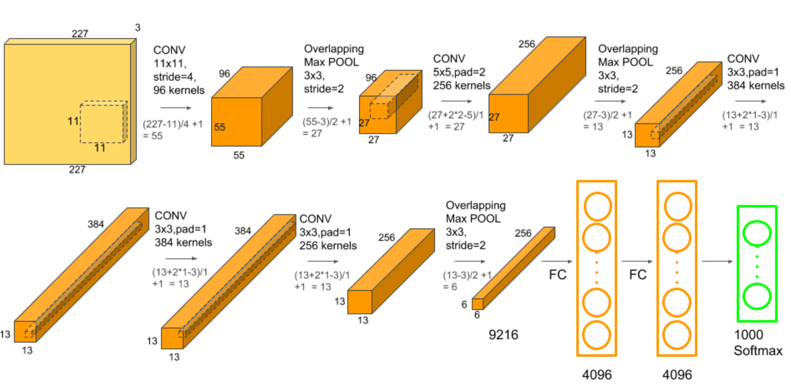

# Архитектуры сверточных нейронных сетей

Классическая сверточная нейронная сеть (СНС) состоит из трех видов слоев: слои свертки, слои подвыборки и полносвязные слои (в англоязычной литературе имемуемые convolutional, pooling и fully connected, соответственно).

Вместе они складываются в следующую архитектуру:

## 1. Convolution layer

Самый первый слой СНС. Предназначен для извлечения признаков из изображения и преобразования их в карту признаков с помощью фильтров.Карты признаков чаще всего дают информацию о каких-либо границах и углах в изображении. 

Карты подаются в качестве входных данных следующим слоям. 

## 2. Pooling layer

Слой, обычно следующий за convolution layer. Основная цель этого слоя — понизить размерность карты признаков для упрощения вычислений. 
Уменьшение размерности достигается за счет различных операций пулинга. В max pooling из области на карте признаков выбирается максимальный элемент, в average pooling — средний, в sum pooling — сумма элементов.  

Pooling layers обычно выступает мостом между convolution layer и fully connected layer. 

## 3. Fully Connected Layer

Полносвязные (FC) слои состоят из нейронов, с каждым из которых ассоциируются коэффициенты (weight и bias). Классические слои многослойного персептрона.

В СНС полносвязные слои обычно располагаются сразу перед выходным слоем, в них и происходит классификация.

### Но есть и другие компоненты СНС, также важные для построения грамотной архитектуры сети

## 4. Dropout layer

Серьезной проблемой, с которой сталкиваются модели машинного обучения, является переобучение. Dropout — один из способов борьбы с переобучением в нейронных сетях, в том числе СНС. Отмечено, что в борьбе с переобучением может помочь использование ансамбля моделей и усреднение полученных результатов, однако такой способ вычислительно крайне громоздкий. Дропаут же, наоборот, уменьшает количество нейронов в слое.

Если говорят, что нейрон "опускается" (дропается) из слоя, под этим стоит понимать временное игнорирование нейрона и всех его входящих и исходящих соединений с другими слоями. 
Dropout может применяться на любых слоях сети, кроме выходного. 
Реализуется этот механизм посредством ввода нового гиперпараметра *p* — вероятности, с которой нейроны в слое будут "дропнуты". Значение *p = 0.5* достаточно оптимально для многих случаев. Если же dropout применяется к входному слою, то предпочтельнее более высокие значения *p*, ближе к 1.0 нежели 0.5.

Отсутствие некоторых нейронов в сети будет компенсироваться увеличением весов соседних нейронов в слое, поэтому после звершения обучения стоит нормализовать веса, например, умножив их на dropout rate (*p*). Можно включить этап нормализации весов в mini-batch градиентный спуск, как это реализовано, например в Keras и PyTorch.

## 5. Activation function

Функция активации — еще один важный элемент любой нейронной сети. С помощью них сеть может аппроксимировать нелинейную функцию любой сложности. Часто используемые функции активации: softmax, ReLU, сигмоид, гиперболический тангенс и др. У каждой функции есть своя специфика, например, для бинарной классификации лучше подходят сигмоид или softmax, для мультиклассовой же классификации предпочтительнее softmax.

# Известные архитектуры СНС

## LeNET-5

Самая первая СНС-архитектура, создана в 1998 году.

1) Входной слой принимает изображения размером 32х32
2) Свертка 6-ю фильтрами рамером 5х5, результирующий размер данных 28х28х5
3) Пулинг с ядром 2х2, результирующий размер данных 14х14х5
4) Свертка 16-ю фильтрами 5х5, размер данных 10х10х16
5) Пулинг 2х2, размер данных на выходе 5х5х16
6) Полносвязный слой с 400 узлами
7) Полносвязный слой с 84 узлами
8) Выходной слой с *n* узлами, где *n* — количество классов согласно поставленной задаче

## AlexNet

Разработана в 2012 году Alex Krizhevsky, Ilya Sutskever, и Geoff Hinton. Архитектура, популяризовавшая СНС. Предназначена для классификации изображений больших размеров. Состоит из 5 сверточных слоев с макс-пуллингом, 3 полносвязных слое и 2 слое с дропаутом. В качеств функции активации использовалась ReLU (кроме выходного слоя, там softmax). 

Общее число параметров в этой архитектуре около 60 миллионов. 

### Источники

[Basic CNN Architecture: Explaining 5 Layers of Convolutional Neural Network](https://www.upgrad.com/blog/basic-cnn-architecture/)

[A Gentle Introduction to Dropout for Regularizing Deep Neural Networks](https://machinelearningmastery.com/dropout-for-regularizing-deep-neural-networks/)

[Different Types of CNN Architectures Explained: Examples](https://vitalflux.com/different-types-of-cnn-architectures-explained-examples/)

